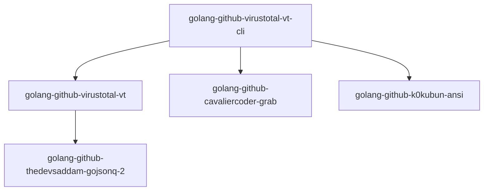

# Dependencies

```mermaid
graph TD
    golang-github-virustotal-vt --> golang-github-thedevsaddam-gojsonq-2;
    golang-github-virustotal-vt-cli --> golang-github-virustotal-vt;
    golang-github-virustotal-vt-cli --> golang-github-cavaliercoder-grab;
    golang-github-virustotal-vt-cli --> golang-github-k0kubun-ansi;
```
# TODO
